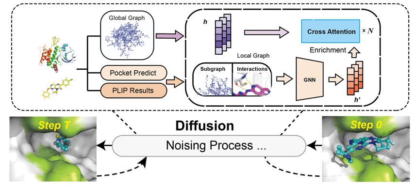

# SGEDiff: A Subgraph-Enriched Diffusion Model for Structure-Based 3D Molecular Generation


##  Environment Setup
Install dependencies using `conda`:

```bash
conda env create -f environment.yml
conda activate sgediff
```

## Data
```
data/
├── complex_001/
│   ├── complex_001_protein.pdb
│   └── complex_001_ligand.sdf
├── complex_002/
│   ├── ...
```


## Training

Run the following command to train the model:

```bash
python model.train.py
```

## 💡 Sampling

Sampling is performed via `start_sample.py` and supports two modes:
### Mode 1: Protein + Ligand 

If both protein and ligand structures are available, the model uses them as input to guide generation.

### Mode 2: Protein Only 

If only the protein structure is provided, the model will perform de novo ligand generation.

The model automatically detects whether ligand information is provided and switches between:

- `SGEDiff`: guided mode 
- `SGEDiff-NG`: non-guided mode

To run sampling:

```bash
python start_sample.py
```

Sampling results will be saved under:

```
model_results/<model_name>/
```
## Post-Processing

After sampling, convert the output into RDKit-readable molecules using:

```bash
python utils/model_evaluation.py --input model_results/<model_name>/
```

## License

This project is licensed under the MIT License.
